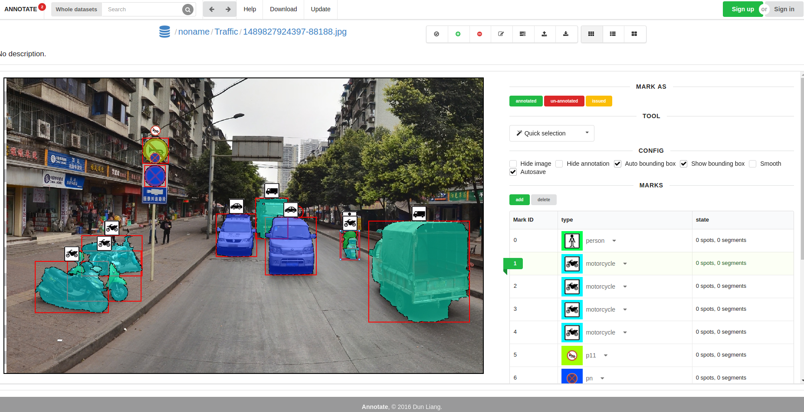
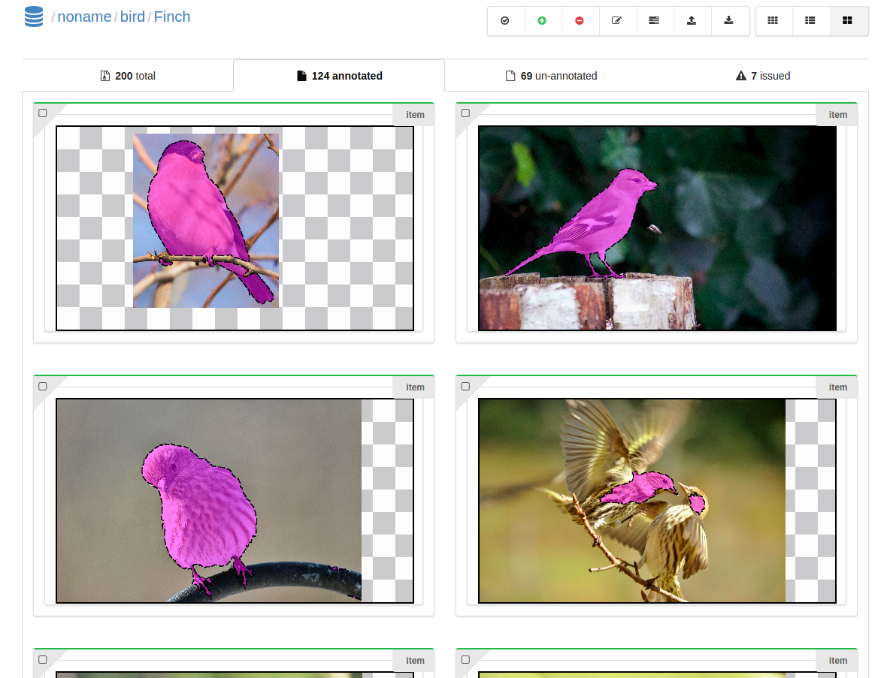

# ANNOTATE
An online annotation tool with image editing.

# Screenshots


-----



# Features
*   Useful tools(Quick Selection, Segment, Spotting, Painting)
*   Task Manage System
*   low latency(local versiong supported, build from Electron)

# Install

```
sudo apt-get install mongodb
sudo npm install -g nodemon http-server request


npm instsll
bower install
cd utils
./start-all.sh
```

# Download
Local versions are build from Electron. you can download [here](http://anno.randonl.me:9200:download)

# TODO
*   [ ]  local refine, recalc all
*   [ ]  config reload bug
*   [ ]  contour right mouse selection
*   [x]  dataset config
*   [x]  speed up big image
*   [ ]  well git maintain
*   [x]  file uploader
*   [ ]  crash restart
*   [ ]  admin
*   [ ]  help update
*   [x]  type bug
*   [x]  config refresh
*   [x]  page error
*   [ ]  less request
*   [ ]  crash handle
*   [x]  electron
*   [x]  session reuse
*   [x]  image load icon
*   [x]  goto id in search-bar
*   [x]  record-stroke
*   [x]  local icon
*   [x]  draw all viewer
*   [ ]  soft link
*   [ ]  dataset maintain
*   [x]  fj
*   [ ]  code converge test
*   [x]  dev env
*   [x]  forget password
*   [ ]  google login, wechat login
*   [x]  task
*   [x]  mission
*   [ ]  params page url
*   [ ]  permission
*   [ ]  socket io save
*   [ ]  task error
